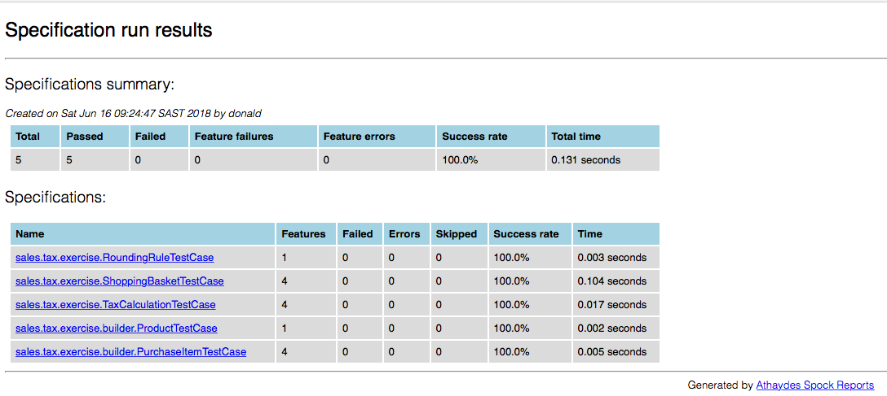

# Execute the build
To run the build, simply type the following in command line:
```bash
mvn test
```

## Spock Reports
After the build has run, the test reports can be found in _target/spock-reports_. Use a browser to view the _index.html_ file.
### Specifications Summary Page

### Feature Summary Page


