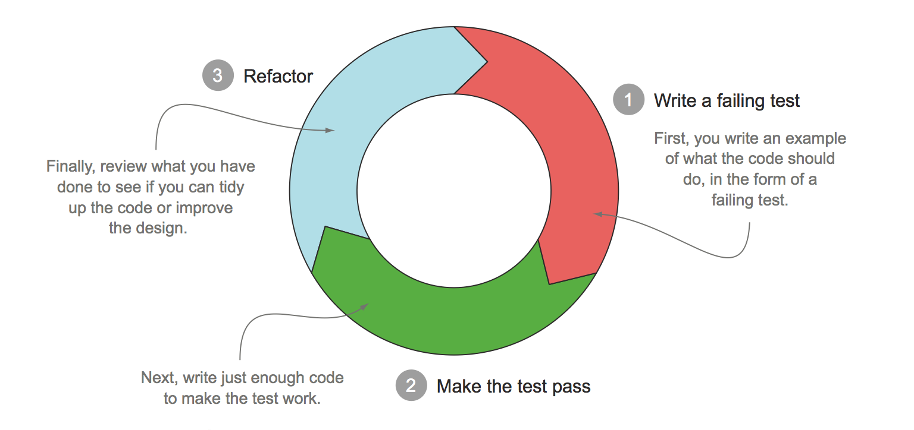
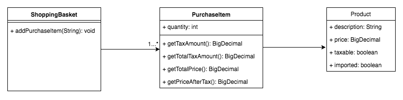

# SALES TAXES
Basic sales tax is applicable at a rate of 10% on all goods, except books, food, and medical products that are exempt. Import duty is an additional sales tax applicable on all imported goods at a rate of 5%, with no exemptions.
When I purchase items I receive a receipt which lists the name of all the items and their price (including tax), finishing with the total cost of the items, and the total amounts of sales taxes paid.  The rounding rules for sales tax are that for a tax rate of n%, a shelf price of p contains (np/100 rounded up to the nearest 0.05) amount of sales tax.
Write an application that prints out the receipt details for these shopping baskets...

### INPUT

Input 1:  
1 book at 12.49  
1 music CD at 14.99  
1 chocolate bar at 0.85

Input 2:  
1 imported box of chocolates at 10.00  
1 imported bottle of perfume at 47.50  

Input 3:  
1 imported bottle of perfume at 27.99  
1 bottle of perfume at 18.99  
1 packet of headache pills at 9.75  
1 box of imported chocolates at 11.25

### OUTPUT

Output 1:  
1 book : 12.49  
1 music CD: 16.49  
1 chocolate bar: 0.85  
<b>Sales Taxes: 1.50 </b> 
<strong> Total: 29.83 </strong>

Output 2:  
1 imported box of chocolates: 10.50  
1 imported bottle of perfume: 54.65  
<b>Sales Taxes: 7.65 </b>  
<strong> Total: 65.15 </strong>

Output 3:  
1 imported bottle of perfume: 32.19  
1 bottle of perfume: 20.89  
1 packet of headache pills: 9.75  
1 imported box of chocolates: 11.85  
<b> Sales Taxes: 6.70 </b>  
<strong> Total: 74.68 </strong>

# Solution
Normal developer instinct would dictate that you straight away write the implementation without the test case, but that is not the way how **Test Driven Development** (TDD) works...

# TDD Primer
The basic premise of TDD is that you write a test before writing the code that actually provides the implementation, and then you refactor that implementation as needed.
## The TDD 3-phase cycle
When TDD practitioners need to implement a feature, they first write a failing test that describes, or specifies, that feature. Next, they write just enough code to make the test pass. Finally, they refactor the code to help ensure that it will be easy to maintain.

Let us see how can apply these TDD techniques to fulfil the requirements given above.

## Test Case Analysis
Before we even start any coding, I recommend we look at the requirements and try and deduce the test scenarios.  
<table>
  <caption>Input 1</caption>
  <tr>
    <th>Items</th>
    <th>Receipt</th>
    <th>Tax</th>
    <th>Test Scenario</th>
  </tr>
  <tr>
    <td>1 book at 12.49</td>
    <td>12.49</td>
    <td>0.00</td>
    <td>Item exempt from Sales Tax</td>
  </tr>
  <tr>
    <td>1 music at 14.99</td>
    <td>16.49</td>
    <td>1.50</td>
    <td>Taxable Item</td>
  </tr>
  <tr>
    <td>1 chocolate box at 0.85</td>
    <td>0.85</td>
    <td>0.00</td>
    <td>Item exempt from Sales Tax</td>
  </tr>
</table>

<table>
  <caption>Input 2</caption>
  <tr>
    <th>Items</th>
    <th>Receipt</th>
    <th>Tax</th>
    <th>Test Scenario</th>
  </tr>
  <tr>
    <td>1 imported box of chocolates at 10.00</td>
    <td>10.50</td>
    <td>0.50</td>
    <td>Imported and tax exempt item</td>
  </tr>
  <tr>
    <td>1 imported bottle of perfume at 47.50</td>
    <td>54.65</td>
    <td>7.15</td>
    <td>Imported and taxable item</td>
  </tr>
</table>

<table>
  <caption>Input 3</caption>
  <tr>
    <th>Items</th>
    <th>Receipt</th>
    <th>Tax</th>
    <th>Test Scenario</th>
  </tr>
  <tr>
    <td>1 imported bottle of perfume at 27.99</td>
    <td>32.19</td>
    <td>4.20</td>
    <td>Imported and taxable item</td>
  </tr>
  <tr>
    <td>1 bottle of perfume at 18.99</td>
    <td>20.89</td>
    <td>1.90</td>
    <td>Taxable Item</td>
  </tr>
  <tr>
    <td>1 packet of headache pills  at 9.75</td>
    <td>9.75</td>
    <td>0.00</td>
    <td>Item exempt from Sales Tax</td>
  </tr>
  <tr>
      <td>1 box of imported chocolates at 11.25</td>
      <td>11.85</td>
      <td>0.60</td>
      <td>Imported and tax exempt item</td>
    </tr>
</table>

There are clearly four test scenarios that need to be considered, namely:
1. Item exempt from Sales Tax
2. Taxable Item
3. Imported and taxable item
4. Imported and tax exempt item  

Before we start with the test cases, lets do a preliminary domain design.

## Domain Model

